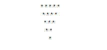
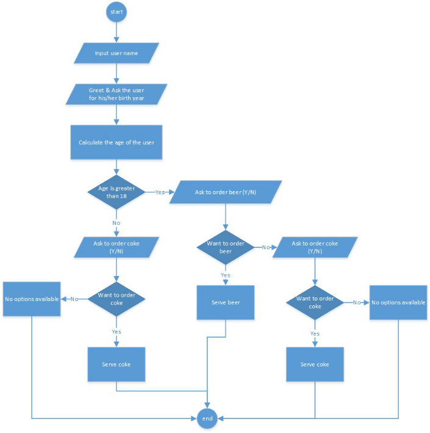
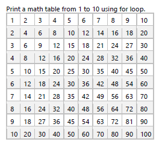

# C# Basic Assignment 1

## Prerequisite 
You have to solve all the exercises in a single file. Just to make it more structured you have to solve each exercise in a separate method and call that method in a respective switch case. 
Start with a given project which contains a sample code. Add new methods for next exercises. 
*I added the provided code in the repo as Starter.cs*

## Exercise 1 (Name the method as ExerciseOne ) 
Declare two string variables, one of them is going to store your first name and the other your last name, so assign them informative names. Then let the program print following output on a console: 
“Hello <firstname> <lastname>! I’m glad to inform you that you are the test subject of my very first assignment!” 

## Exercise 2 
Ask user to enter his firstname and lastname from the console and greet the user ‘Have a nice day!’ 
Ex. "Hello Nalini Phopase! Have a nice day!" 

## Exercise 3 
Ask user to enter two consecutive numbers and write the code to validate them (are they numbers?) and display message accordingly

```
Example 1 - user enters: 2, 3
Result: Consecutive
Example 2 – user enters: 4, 6
Result: Not consecutive
```

## Exercise 4 
Display today’s date in different date formats. Also display tomorrows date and yesterday’s date using short date format. 

## Exercise 5 
a) Add any two integer numbers and store the sum result in a variable of type double. 
b) Add any two decimal numbers (use variables of type double) and store the sum result in a variable of type integer. If you get any error try to resolve it. 
c) Store an even number and an odd number in two different integer variables. Divide odd number by even number and display an accurate result. 

## MATHEMATICAL OPERATORS 
C# uses the standard order of operations to do calculations so (), *, / and % (modulo) has priority over + and -. 
When dividing integers in c#, this is done with integer division. This means 10 / 3 will yield the result 3, instead of 3.333… as you might expect. This is due to that 10 is divisible 3 whole times with 3 with the rest of 1 which will be thrown away. 
To get the rest, use the modulo operator like int rest = 10 % 3; which yields back 1. 
To get the floating point result back, you need to tell the c# compiler to temporary treat either the nominator or denominator as a floating point number. This can be done by type casting either like double result = 10 / (double) 3; or explicitly set one as a floating point literal by adding a decimal to the end double result = 10.0 / 3; 
Type casting will not affect the variable being type casted, and when type casting a decimal number to an integer, the number will be truncated. int rest = (int) 3.9999; 

## Exercise 6 
```
int x = 40; 
int y = 20; 
int z = 25; 
int m = 15; 
int e,f,g,h; 
```

Use appropriate order of precedence by using formula: x + y * z / m to get following result:
e =100, f = 60 and g = 73.
With same formula you can also get one more result – h. Try to find the right order of precedence and the value.

## Exercise 7 
Ask user to enter any positive integer, check and display message whether number is even or odd 

## Exercise 8 
Generate and store 20 random integer numbers in a list and separate those numbers in to two new lists. One with even numbers and one with odd numbers.

## Exercise 9 (Optional) 
Ask user to enter a value of a radius. Calculate the area of a circle and a sphere and display the result on the console. 

## Exercise 10 
Ask the user to enter any 10 numbers and store them in an array. Print only the negative numbers on the console.
 
## Exercise 11 
Ask user to enter his body temperature in degree Celsius. Display him a message if he has a fever or not. 

## Exercise 12 
Ask user to enter current year and validate it.

## Exercise 13 (Optional) 
Write a program that asks user an arithmetic operator ('+','-','*' or '/') and two operands. Perform the corresponding calculation on the operands and display the result (use switch case) 

## Exercise 14 
Ask user to enter his grade of exam (A, B, C, D, E) and print a relevant message for him as per the grade he has.

## Exercise 15 
Ask user to enter any number smaller than 100. Print all values from 1 to the entered number in ascending and descending order. 
Write the same program using for, while and do-while loop 

## Exercise 16
Ask user to enter some date and write code to define whether it is past, present or future year.
```
2022-01-5: Present 
2000-08-12: Past 
2023-01-01: Future
```

## Exercise 17 (Optional) 
Print leap years between 1990 to current year using while loop 

## Exercise 18 
Generate a random number and save it to a variable, SecretNumber. 
If he/she miss the first guess ask the user if he/she wants to guess the number again. Repeat the guessing until user answers yes or guess the correct number. 

## Exercise 19 (Optional) 
Print the following * pattern on console using loop 



## Exercise 20 (optional) 
Write a program that keeps asking the user to enter numbers, until he enters -1. Then displays a sum and average of all numbers entered before -1 

## Exercise 21 (Optional) 
Write a program to print the Fibonacci series 

## Exercise 22 
Write a program to calculate the area of triangle where the user has to pass height and width as a parameter 

## Exercise 23 
Write a program to add 2, 3 and 4 float values using AddNumbers method (all three methods using the same name), pass these float values as a parameter, Print result inside the method. 

## Exercise 24(Optional) 
Write a program to find the greatest number in an array. Pass an array of 5 numbers as a parameter to a method and return a greatest number from the method and then print it. 

## Exercise 25 
Write a swap function for swapping two numbers. Pass values as a parameter. Print the swapped values inside function as well at the next line where you called this function. 

## Exercise 26 
Write a swap function for swapping two numbers. Pass values as a parameter using ref type. Print swapped values inside function as well at next line where you called this function. 

## Exercise 27 
Let the user input any string, then check if the string is a palindrome sentence or not.

## Exercise 28 
Ask user to enter any twelve positive integer numbers. Store these numbers to an array. Display all numbers and then separate the numbers into an odd number array and even number array. 

## Exercise 29(Optional) 
Create two arrays with arbitrary size and fill one with random numbers. Then copy over the numbers from the array with random numbers to the other array so that the even numbers are added (placed) first and odd numbers last in the array.

## Exercise 30 (Optional) 
Create an array. Set the size of an array as a random number between 5 and 15. Sort this array without using sort method. 

## Exercise 31(Optional) 
Create an array. Set the size of an array as a random number smaller than 16. Fill in the array with random numbers (positive, smaller than 100, not repeated). Create another array of the same size and ask the user if he/she wants to fill in the array with either square or cube result of the values from previous array. 

## Exercise 32 
Let the user input a string with numbers comma separated like “1,2,34,83,19,45”. Convert the number string to an array and find the min, the max and the average value. (Use strings split function if required)

## Exercise 33 : String manipulation 
A) Change string “The quick fox Jumped Over the DOG” to the string “The brown fox jumped over the lazy dog” using required string manipulation functions. 
B) Enter any two words from console and check whether they are same words or not 
C) Input word Donkey and display it as the word Monkey on the console. 
D) Replace ‘I’ with ‘We’ and ‘am’ with ‘are’ in given text below. 

“I am going to visit Kolmården zoo tomorrow. I am a big fan of the dolphin show. I may watch all dolphin shows during the day. I would like to take a gondola safari as well. I wish to visit Bamse and his team there.” 
E) Actual string is "She is the popul
ar singer." and the expected string is "She is the most popular singer." 
F) Actual string is "A friend is the asset of your life." and the expected string is "A true friend is the greatest asset of your life" 
G) Actual string is "My name is Nalini Phopase." Expected string: "Nalini Phopase" 
H) Actual string is "Arrays are very common in programming, they look something like: [1,2,3,4,5]" Expected string: "[1,4,5,6,7,8]" 

## Exercise 34:
Ask the user to enter his date of birth. Calculate his age and display it on console. 

## Exercise 35:
Ask the user to enter his name and save it into a Name variable. 
Greet the user by his name, and ask for his/her birth date. Call Calculate Age method from exercise to calculate the age of the user. 
 If the user is 18 or above 18 
 Ask if the user wants to order a beer 
• If yes 

Display a message that the order has been done!  
• If No 

Ask if he/she want to order a coke 
o If yes 

Display a message that the coke has been served 
o If No: 

Display a message that no order options are available 
 If the user is below 18 
 Ask if the user want to order a coke 
• If Yes: 

Display a message that the coke has been served 
• If No: 

Display a message that no order options are available 
Below (Figure 3) is a Flow chart diagram that shows the application flow.



## Exercise 36:

